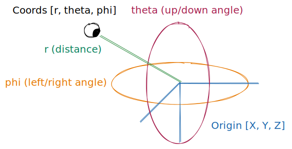

# r3f-orbit-controls

This library replaces three.js's OrbitControls with a React + Zustand component. 

A demo is available [here]()

# Getting started

r3f-orbit-controls consists of two parts, the camera and the input handler.

## Camera

The `<OrbitCamera \>` component creates a camera, whereas `useCamera` provides the accompanying Zustand state.

The camera state describes a target position relative to the world (`origin`) and a position relative to the target (`coords`).



```
origin: [x, y, z], // world target

coords: [
  r, // Distance to origin
  theta, // Polar (up-down) angle
  phi // Azimuthal (left-right) angle
]
```

